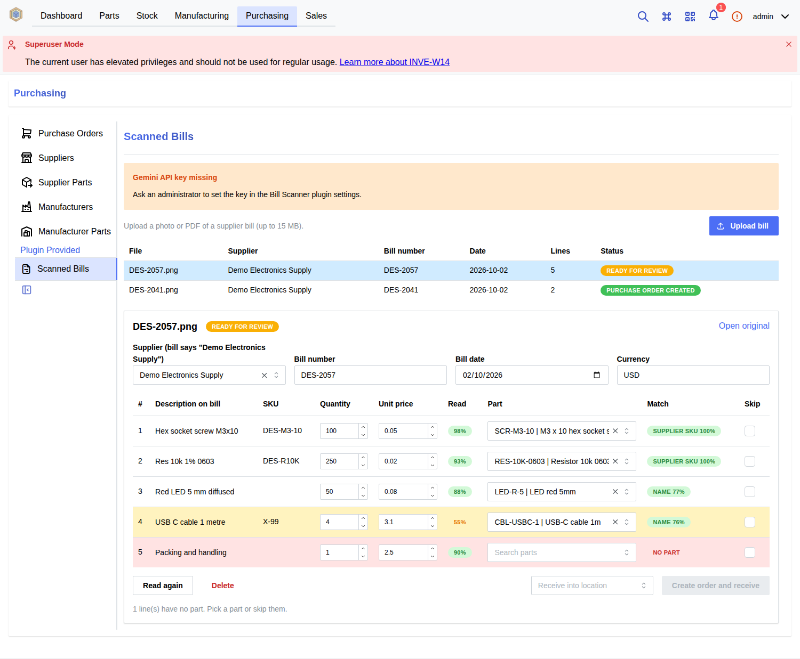

# inventree-bill-scanner

**An [InvenTree](https://inventree.org) plugin that turns a photo or PDF of a
supplier bill into a received purchase order. Google Gemini reads the bill
and a person checks the result.**

[](LICENSE)
[](https://www.python.org/)
[](#installation)
[](https://github.com/nisha-karithikeyan/inventree-bill-scanner/actions/workflows/ci.yml)
[](CONTRIBUTING.md)

> **Status: beta (v0.1.0).** Covered by automated tests, but extraction has
> so far only been tested with mocked Gemini responses. Real-world accuracy
> will be published in [`eval/results/`](eval/README.md) once measured.

## What it does

[InvenTree](https://inventree.org) is an open-source inventory management
system ([GitHub](https://github.com/inventree/InvenTree)) developed by the
InvenTree community. This repository is a separate plugin for it that adds
one workflow: when goods arrive with a bill, you no longer type the bill in
by hand.

1. **Upload** a photo or PDF on **Purchasing → Scanned Bills**.
2. **Gemini reads it** in the background: supplier, bill number, date, and
   each line's description, quantity and unit price.
3. **Lines are matched** to your existing parts by supplier SKU, manufacturer
   or internal part number, or fuzzy name, each with a confidence score.
4. **You review it.** Uncertain or unmatched lines are highlighted, and
   anything can be corrected.
5. **One click** creates the purchase order and receives the stock. Bills
   already received are refused, and every action is audit-logged.

<!-- Demo GIF: record it with docs/DEMO.md, save it as docs/demo/demo.gif, then
     replace this comment with:

-->



<sub>Development instance with fictional demo data.</sub>

## Installation

**Requires:** InvenTree (tested with 1.6.0 dev; earlier versions are
untested), Python 3.12, a running InvenTree background worker, and a
[Gemini API key](https://aistudio.google.com/apikey).

1. Install into InvenTree's Python environment, or add the same line to
   `plugins.txt` for Docker installs:

   ```bash
   pip install git+https://github.com/nisha-karithikeyan/inventree-bill-scanner
   ```

2. In **Admin Center → Plugin Settings**, enable the **app**, **URL**,
   **interface** and **schedule** integrations.
3. Restart InvenTree, then run `invoke migrate` and `invoke static`.
4. In **Admin Center → Plugins**, activate **Bill Scanner** and enter your
   **Gemini API Key** in its settings.

[docs/FIRST_TEST.md](docs/FIRST_TEST.md) walks through a first end-to-end
test. All settings and permissions are listed in
[docs/REFERENCE.md](docs/REFERENCE.md).

## How it works

```text
 upload ──▶ REST API ──▶ django-q2 task ──▶ Gemini (JSON schema) ──▶ parse + validate ──▶ match parts ──▶ review panel ──▶ purchase order + stock
```

- **Background extraction.** InvenTree's own task queue runs the Gemini call.
  Timeouts and rate limits are retried with exponential backoff.
- **Structured output.** Gemini must answer in a fixed JSON schema, and every
  value is still validated before it is saved.
- **Matching** trusts exact codes first and fuzzy names last. A code shared
  by several parts is never trusted.
- **Receiving** uses InvenTree's own purchase order functions, in one
  database transaction, with duplicate checks and an audit log.
- **Privacy:** the API key is a protected setting, sent only in a header and
  only to `googleapis.com`. Bills are sent to Google for reading. See
  [SECURITY.md](SECURITY.md).

The plugin uses only InvenTree's public plugin interfaces and does not modify
InvenTree.

## Documentation

| Document                                   | Contents                                             |
| ------------------------------------------ | ---------------------------------------------------- |
| [docs/REFERENCE.md](docs/REFERENCE.md)     | Settings, permissions, architecture, REST API, tests |
| [docs/WALKTHROUGH.md](docs/WALKTHROUGH.md) | Code walkthrough and design decisions                |
| [docs/FIRST_TEST.md](docs/FIRST_TEST.md)   | Entering the key and a first end-to-end test         |
| [docs/DEMO.md](docs/DEMO.md)               | Demo data and a 30-second demo script                |
| [eval/README.md](eval/README.md)           | Measuring extraction and matching accuracy           |
| [CONTRIBUTING.md](CONTRIBUTING.md)         | Development setup, tests, commit and PR conventions  |
| [CHANGELOG.md](CHANGELOG.md)               | Release history                                      |

## Contributing

Issues, ideas and pull requests are welcome. See
[CONTRIBUTING.md](CONTRIBUTING.md) and the [Code of Conduct](CODE_OF_CONDUCT.md).
Please report security problems privately, as described in
[SECURITY.md](SECURITY.md).

## Acknowledgements and disclaimer

Built on [InvenTree](https://inventree.org) and its plugin framework; thanks
to the InvenTree developers and community. This is an independent community
plugin, not affiliated with or endorsed by the InvenTree project, so please
report problems here. Matching uses
[RapidFuzz](https://github.com/rapidfuzz/RapidFuzz), and bills are read by
[Google Gemini](https://ai.google.dev/).

## Author

Created and maintained by **Nisha Karthikeyan**:
[GitHub](https://github.com/nisha-karithikeyan) ·
[LinkedIn](https://www.linkedin.com/in/nisha-karthikeyan)

## License

[MIT](LICENSE) © 2026 Nisha Karthikeyan
