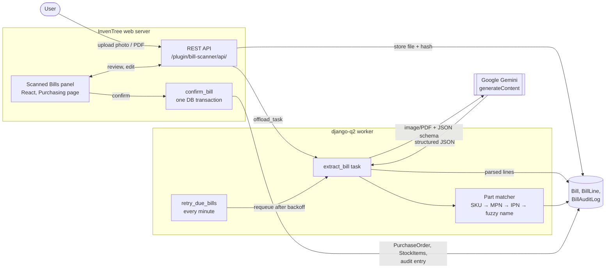
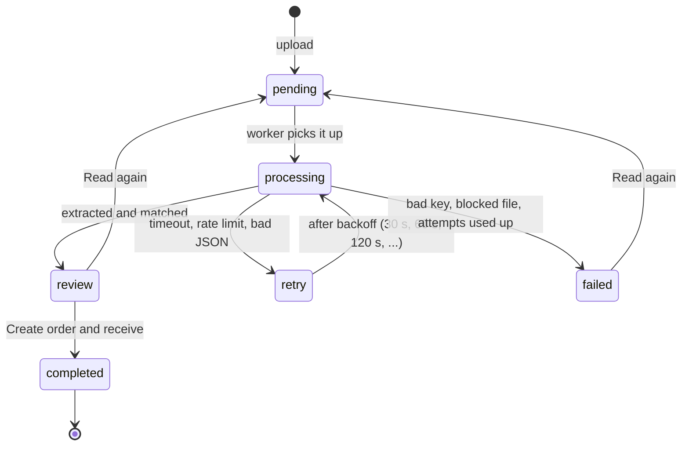

# Reference

Detailed configuration and design notes for inventree-bill-scanner. For a
guided tour of the code, see [WALKTHROUGH.md](WALKTHROUGH.md). For setup and
contributing, see [CONTRIBUTING.md](../CONTRIBUTING.md).

## Contents

- [Settings](#settings)
- [Permissions](#permissions)
- [Architecture](#architecture)
- [REST API](#rest-api)
- [Privacy and security](#privacy-and-security)
- [Tests](#tests)

## Settings

| Setting                  | Default                                    | Meaning                                                                  |
| ------------------------ | ------------------------------------------ | ------------------------------------------------------------------------ |
| Gemini API Key           | (empty)                                    | Required. Stored as a protected setting and never sent to the browser.   |
| Gemini Model             | `gemini-2.5-flash`                         | A Gemini model that accepts images and PDFs.                              |
| Gemini API Host          | `generativelanguage.googleapis.com/v1beta` | Only `googleapis.com` hosts are accepted (regional endpoints are fine).  |
| Request Timeout          | 120 s                                      | How long one Gemini call may take.                                       |
| Maximum Attempts         | 3                                          | Total tries for a bill before it is marked failed.                       |
| Maximum Upload Size      | 15 MB                                      | Largest accepted file (Gemini's inline data limit is about 20 MB).       |
| Minimum Name Match Score | 70                                         | Fuzzy name matches below this score (0–100) are ignored.                  |
| Low Confidence Threshold | 75                                         | Lines below this confidence (0–100) are highlighted.                     |

## Permissions

The plugin uses InvenTree's existing roles. No new roles are added.

| Action                   | Needs                                  |
| ------------------------ | -------------------------------------- |
| See the panel and bills  | Purchase order: view                   |
| Upload a bill            | Purchase order: add                    |
| Edit lines, read again   | Purchase order: change                 |
| Delete a bill            | Purchase order: delete                 |
| Create order and receive | Purchase order: add **and** Stock: add |

## Architecture

### Bill lifecycle

### Code layout

| Module                       | Responsibility                                                           |
| ---------------------------- | ------------------------------------------------------------------------ |
| `bill_scanner/core.py`       | Plugin class: settings, URLs, UI panel, scheduled task, Gemini HTTP call |
| `bill_scanner/models.py`     | `Bill`, `BillLine`, `BillAuditLog`                                       |
| `bill_scanner/gemini.py`     | Request body, file type sniffing, host allowlist, error classification  |
| `bill_scanner/extraction.py` | JSON schema and prompt for Gemini; parsing and validating its reply     |
| `bill_scanner/tasks.py`      | Background extraction, retries with backoff, recovery of stuck bills    |
| `bill_scanner/matching.py`   | Supplier and part matching with confidence scores                       |
| `bill_scanner/services.py`   | Duplicate checks; creating, placing and receiving the purchase order    |
| `bill_scanner/api.py`        | REST views                                                               |
| `frontend/src/`              | React review panel, built into `bill_scanner/static/BillScanner.js`      |
| `eval/`                      | Accuracy evaluation against hand-written ground truth                   |

The plugin uses only InvenTree's public plugin mixins (`AppMixin`,
`APICallMixin`, `ScheduleMixin`, `SettingsMixin`, `UrlsMixin`,
`UserInterfaceMixin`) and its own models. It does not change any InvenTree
table. [WALKTHROUGH.md](WALKTHROUGH.md) explains every step in
detail.

### Matching and confidence

Lines are matched in this order. The first hit wins.

| Method                         | Confidence | Notes                                                |
| ------------------------------ | ---------- | ---------------------------------------------------- |
| SKU of this supplier's part    | 100%       |                                                      |
| Manufacturer part number (MPN) | 92%        | Only when exactly one part has that MPN              |
| Internal part number (IPN)     | 92%        | Only when exactly one part has that IPN              |
| SKU of another supplier's part | 85%        | Only when exactly one part has that SKU              |
| Fuzzy name match               | up to 90%  | `rapidfuzz` token set ratio on name and description  |
| Chosen by user                 | 100%       | Set when you pick a part in the review table         |

Codes printed inside the description (for example "Resistor RC0603-10K") are
also tried, at 95% of the confidence above. Parts this supplier already
supplies get a small bonus when names tie. The supplier itself is matched by
fuzzy name, ignoring suffixes such as Ltd, GmbH or Inc.

The **Read** column in the review table is Gemini's own confidence in the
values it read. The **Match** column is the matcher's confidence in the part.
A line is highlighted when either is below the threshold or it has no part.

### Duplicate protection

A bill is refused when:

- the same file (by SHA-256) was uploaded before (HTTP 409 on upload), or
- a received bill, or any purchase order, from the same supplier already has
  the same bill number (HTTP 409 on confirm). Numbers are compared without
  case, spaces or punctuation, so `INV-001` and `inv 001` are the same bill.

A database constraint backs up the second check, so two people confirming at
the same moment cannot both succeed.

### Audit log

Every upload, header edit, line edit, deletion and confirmation is stored in
`BillAuditLog` with the user and a timestamp. A confirmation entry records the
purchase order, stock items, location, currency and every line with its part,
quantity, price and match method. Entries are kept even when a bill is
deleted. They are available at `GET /plugin/bill-scanner/api/bills/<id>/audit/`.

## REST API

All endpoints are below `/plugin/bill-scanner/api/` and use InvenTree's normal
authentication (session or token).

| Method | Path                       | Purpose                                                            |
| ------ | -------------------------- | ------------------------------------------------------------------ |
| GET    | `bills/`                   | List bills; filter with `?status=review,failed`                    |
| POST   | `bills/`                   | Upload a bill (multipart field `file`)                             |
| GET    | `bills/<id>/`              | Bill with header and lines                                         |
| PATCH  | `bills/<id>/`              | Correct supplier, bill number, date or currency                    |
| DELETE | `bills/<id>/`              | Delete a bill that has not been received                           |
| PATCH  | `bills/<id>/lines/<line>/` | Correct a line: part, supplier part, quantity, price, skip         |
| POST   | `bills/<id>/extract/`      | Read a failed or reviewed bill again                               |
| POST   | `bills/<id>/confirm/`      | Create the order and receive it; body `{"location": <id or null>}` |
| GET    | `bills/<id>/audit/`        | Audit trail of the bill                                            |

## Privacy and security

Uploaded bills are sent to Google's Gemini API. Check that this is allowed
for your data before you enable the plugin. Files are kept in InvenTree's
media folder under `bill_scanner/` until the bill is deleted.

- The API key is a protected setting: the API returns it as `***`, and the
  browser only learns whether a key is set.
- The key is sent only in the `x-goog-api-key` header, and only to
  `googleapis.com` hosts. This is checked when the setting is saved and again
  before every call.
- The key is masked in any error text before that text is stored or logged.
- The background task receives only the bill's ID, never the file.

See [SECURITY.md](../SECURITY.md) for the full security design, and for how to
report a vulnerability privately.

## Tests

The backend suite runs inside InvenTree's test runner and never calls Gemini;
HTTP responses are mocked. CI runs lint, the backend tests and the frontend
checks on every push and pull request.

| Test module          | Covers                                                           |
| -------------------- | ---------------------------------------------------------------- |
| `test_plugin.py`     | Registration, settings, protected API key                        |
| `test_gemini.py`     | Request body, file sniffing, responses, allowed hosts, redaction |
| `test_extraction.py` | Parsing numbers, dates, confidence and malformed replies         |
| `test_tasks.py`      | Background task, retries, backoff, stuck bills, key never leaked |
| `test_upload_api.py` | Upload validation, file hash duplicates, deletion, permissions   |
| `test_matching.py`   | Supplier and part matching, confidence, ambiguity                |
| `test_review.py`     | Editing headers and lines, re-matching, UI panel                 |
| `test_confirm.py`    | Order creation, stock receipt, rollback, duplicates, audit log   |
| `test_edge_cases.py` | Disabled plugin, header validation, InvenTree errors             |
| `test_demo.py`       | Demo data is idempotent and the sample bill matches every line   |
